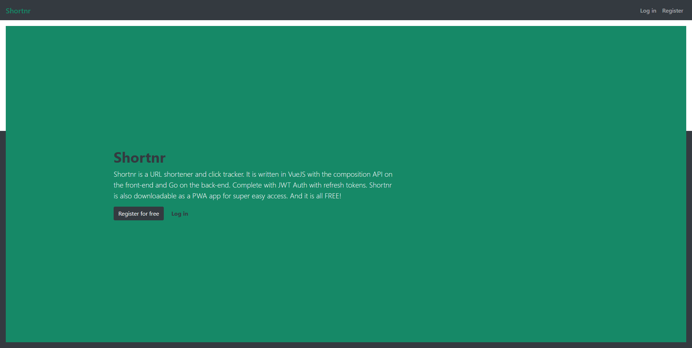

# Shortnr

Shortnr is a URL shortener and click tracker. It is written in VueJS with the composition API on the front-end and Go on the back-end. Complete with JWT Auth with refresh tokens. Shortnr is also downloadable as a PWA app for super easy access.

## Links

* [Client README (VUEJS v3, Bootstrap v5)](./client/README.md)
* [Server README (Go, MySQL)](./server/README.md)

## Screenshot

